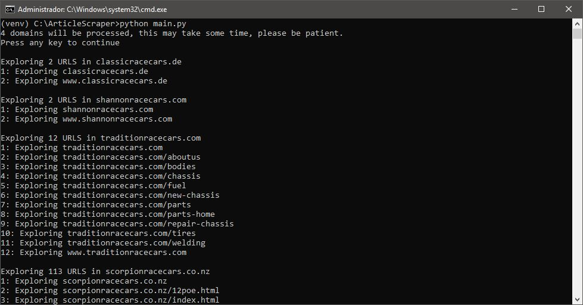
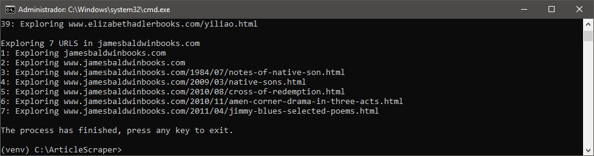

# Nebula Expired Article Hunter
With Nebula Expired Article Hunter you can get tons of expired content that is usually no longer indexed
in search engines like Google or Bing, so you can use it for your website or marketing campaigns,
all by scraping expired websites for their forgotten articles.




## Features
* Low memory consumption.
* Configurable using config.ini file.
* Verbose interface.
* Organize the discovered articles in a friendly way.
* you can scrape as many expired domains as you wish.

## Installation and running 
To install and run this project copy or clone all the files to your preferred folder and type and execute:

```bash
pip install -r requirements.txt
python main.py
```
It's recommended to run in a virtual environment. 

Nebula Expired Article Hunter was developed under `Python 3.9.0` it should be fine in any Python 3 environment.

## TO DO
* Speed up the scraping process.
* GUI.
* Check the articles for plagiarism.
* Add a expired domain scraper.